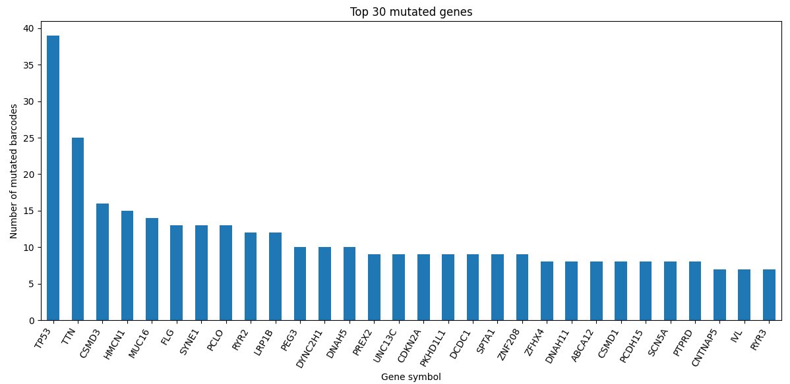
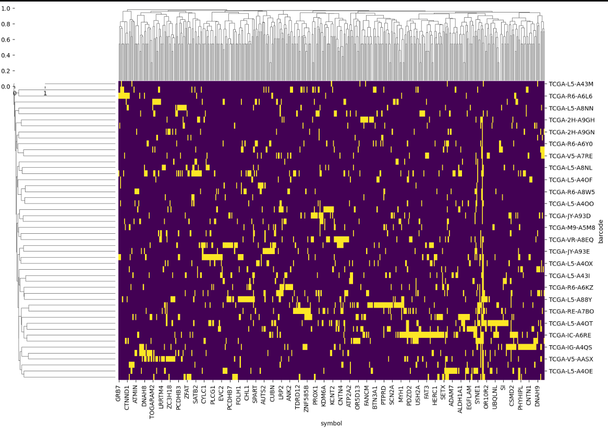
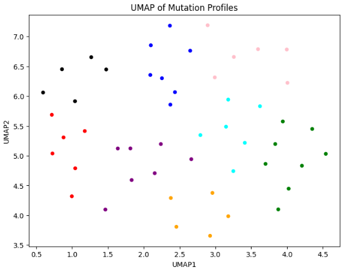

# 🧪 perturb_agent

**Perturb Agent** is a computational framework to identify **patient-specific pathway perturbations**
from TCGA/cBioPortal transcriptomic data and map them to **potential therapeutic targets**.

Current case study: **pancreatic adenocarcinoma (PAAD)**.

**Status**: 🚧 Under development

**Live demo**: [perturb-agent.onrender.com](https://perturb-agent.onrender.com/)

---

## 📑 Table of contents

- [1. Pipeline overview](#1-pipeline-overview)
- [2. Data sources](#2-data-sources)
- [3. Analysis history and design decisions](#3-analysis-history-and-design-decisions)
  - [3.1 Mutation clustering — ❌ negative result](#31-mutation-clustering---negative-result)
  - [3.2 Bulk DE + ComBat + clustering — ❌ negative result](#32-bulk-de--combat--clustering---negative-result)
  - [3.3 The lncRNA artifact — ❌ root cause found](#33-the-lncrna-artifact---root-cause-found)
  - [3.4 Decision: stop transforming, start deconvolving](#34-decision-stop-transforming-start-deconvolving)
- [4. Cell-type deconvolution with BayesPrism](#4-cell-type-deconvolution-with-bayesprism)
- [5. Program-level analysis: challenges and statistical power](#5-program-level-analysis-challenges-and-statistical-power)
- [6. Results: three genes across programs](#6-results-three-genes-across-programs)
- [7. Results: survival (Kaplan–Meier)](#7-results-survival-kaplanmeier)
- [8. Downstream modules](#8-downstream-modules)
- [9. Roadmap](#9-roadmap)
- [10. Reproducibility](#10-reproducibility)
- [11. References](#11-references)
- [12. Contact](#12-contact)

---

## 1. Pipeline overview

| Layer | Tool | Purpose |
|---|---|---|
| UI | [Streamlit](https://streamlit.io/) | Interactive exploration and visualization |
| Containers | [Docker](https://docker-curriculum.com/) | Reproducibility and R/Bioconductor interface |
| Orchestration | [Nextflow](https://www.nextflow.io/) | Scalable, reproducible data processing |
| ML/AI | Python | Pathway scoring, feature attribution, target prioritization |
| Env | [uv](https://docs.astral.sh/uv/) | Project and dependency management |
| Lint/format | [ruff](https://docs.astral.sh/ruff/) | Code linting and formatting |

Pinned UI dependencies:

```
streamlit==1.55.0
protobuf==3.20.3
click==8.0.4
```

Linting:

```bash
uv run ruff check src/libs/*.py --fix > ruff.txt
uv run ruff format src/libs/*.py
```

---

## 2. Data sources

### 2.1 GDC / TCGA

First data layer. Query any [GDC/TCGA](https://portal.gdc.cancer.gov/analysis_page?app=Projects)
cancer type through the chatbot orchestration layer.

Query flow:

```
program      → project_id            gdc.list_gdc_programs()
primary_site → pid, disease_type     gdc.get_primary_sites(program=program)
cases        → case_id (UUID)        gdc.build_cases(pid=pid, subtype=subtype, stage=stage)
                 ├── subtypes → cancer / tissue subtypes
                 └── stages   → stage_id (AJCC)
samples      → sample_type [tumor | normal], file access
barcodes     → patients
```

Coverage retrieved so far:

| Entity | Count |
|---|---:|
| Primary sites | 57 |
| Cases | 11,428 |
| Samples | 245,657 |
| Annotated mutations | 480,826 |
| Distinct genes | 18,961 |

> ⚠️ **To verify**: the sample/case ratio (~21) is high. Confirm that `samples` counts
> biospecimens and not files.

### 2.2 cBioPortal

GDC restricts controlled-access mutation data. [cBioPortal](https://www.cbioportal.org/)
provides anonymized patient demographics plus mutation annotation, so the two sources are
used together.

Demographics retrieval:

```python
cbio.check_clinical_attributes()
cbio.loop_program_psi_get_cases_samples_mut()
```

**Notebooks**
- `tcga_gdc_and_cBioPortal_mutations_loop.ipynb`
- `mtp_cBio_60_PSI_all_programs_CasesSamplesMut_Demographics`

---

## 3. Analysis history and design decisions

This section documents what **did not** work and why. The negative results drove the current
design, so they are kept on purpose.

### 3.1 Mutation clustering — ❌ negative result

**Approach**

1. Select a disease.
2. Retrieve all annotated mutations.
3. Build a binary pivot table: `barcodes × gene symbols`.
4. Cluster:
   - Pairwise Jaccard distance — `pairwise_distances(X, metric="jaccard")`
   - Hierarchical clustering + dendrogram (seaborn)
   - UMAP embedding
   - Group assignment via **kNN**, k = 8

**Jaccard distance**

Jaccard similarity measures how much two sets overlap; Jaccard distance is its complement
and measures how different they are:

$$J(A,B) = \frac{|A \cap B|}{|A \cup B|} \qquad d_J(A,B) = 1 - J(A,B)$$

**Outcome — did not work.** No stable or reproducible patient structure emerged. The
mutation matrix is extremely sparse: most patients share few or no mutated genes beyond a
handful of drivers, so most pairwise Jaccard distances collapse toward 1 and the embedding
is dominated by noise. Clusters were unstable across seeds and k.

**Interpretation.** Most likely **insufficient data** — too few cases per subtype/stage
stratum, and per-patient mutation counts too low to support a similarity-based partition.
Mutation profiles alone are not a sufficient basis for patient stratification here.

Exploratory figures (disease = Esophagus):


*Most mutated genes.*


*Mutation heatmap.*


*UMAP with kNN, k = 8.*

---

### 3.2 Bulk DE + ComBat + clustering — ❌ negative result

**Approach**

1. Retrieve all patient cases (barcodes).
2. Obtain gene expression (raw counts) per patient.
3. Compute DEGs per patient:
   - Control: TCGA solid-tissue normal samples
   - Method: [DESeq2](https://bioconductor.org/packages/release/bioc/html/DESeq2.html)
   - Thresholds: |log2FC| ≥ 1 and FDR < 0.05
4. Batch-correct with **ComBat**, then cluster patients.

**Notebooks**
- `mtp_cBio_63_PAAD_prepare_expression` — differential expression
- `mtp_cBio_62_PAAD_Combat_DE_Cluster` — ComBat + DE + clustering

**Outcome — information loss.** The ComBat + clustering combination removed biological
signal along with batch effect. Bulk expression mixes tumor, stromal and immune
compartments into one average, so per-patient DEGs cannot be attributed to a cell type;
batch correction on top of that averaged away what remained. The resulting clusters were
not interpretable.

---

### 3.3 The lncRNA artifact — ❌ root cause found

**Approach.** HCA + UMAP clustering on the corrected expression matrix. The partition
looked clean and split into apparently meaningful groups.

**Outcome — the clusters were an artifact.** The leading cluster was driven almost entirely
by **lncRNAs**, which is not biologically plausible for PAAD stratification. Tracing it back,
the cause was a **read-counting error: stranded vs. unstranded counts were mixed**, which
inflates antisense and lncRNA signal and creates a spurious dominant axis of variation.

**Lesson.** A visually clean UMAP is not evidence of biology. Every cluster now requires a
plausibility check on its top-loading feature class before it is interpreted.

**Notebook**: `mtp_cBio_64_PAAD_claude_critic_lncRNA_not_bio`

---

### 3.4 Decision: stop transforming, start deconvolving

The three failures above share one cause: **the transformations were doing the damage.**
Jaccard binarization discarded mutation context; ComBat removed real biology; the
count-strand mismatch survived every downstream normalization.

**New rule: do not transform the data.**

- Keep **raw counts**; no ComBat, no ad-hoc batch correction, no rescaling before modeling.
- Fix counting at the source (consistent stranded/unstranded protocol).
- Instead of correcting bulk data, **decompose it** — apply **BayesPrism** to recover
  cell-type composition and cell-type-specific expression, then analyze within cell types.

---

## 4. Cell-type deconvolution with BayesPrism

[BayesPrism](https://github.com/Danko-Lab/BayesPrism) performs Bayesian deconvolution of bulk
transcriptomes against a single-cell reference, returning per-sample **cell-type fractions**
and a per-sample, per-cell-type **expression tensor (Z)**.

- **Input**: raw bulk counts (untransformed)
- **Reference**: Peng *et al.* 2019 PDAC single-cell atlas
- **Output**: cell-type fractions θ + cell-type-specific expression Z
- **Notebook**: `mtp_cBio_65_PAAD_run_bayesprism`

This is the current backbone of the pipeline: everything downstream is computed **within a
cell type or program**, not on the bulk average.

---

## 5. Program-level analysis: challenges and statistical power

Deconvolution yields expression *programs* (cell states) per patient. Testing all of them is
where the analysis becomes fragile.

**Challenges**

1. **Low abundance → no power.** A program present at a small fraction of cells contributes
   few reads, so its deconvolved expression estimate has wide posterior uncertainty. Effect
   sizes are not distinguishable from zero at any usable FDR.
2. **Composition dependence.** Program-level estimates are conditional on θ. When a program's
   fraction is near zero in many patients, its Z values are poorly identified and the
   across-patient comparison is driven by composition rather than by expression.
3. **Multiple testing.** Genes × programs multiplies the hypothesis space; naive FDR control
   across all programs erases the few real signals.
4. **Reference dependence.** Programs absent or underrepresented in the Peng 2019 reference
   cannot be recovered reliably from bulk.

**Filtering strategy applied**

- Require a minimum program fraction per patient and a minimum number of patients above it.
- Require a minimum effective read support for the program's Z estimate.
- Test only surviving programs; apply FDR **within** the retained set.

**Result.** Most programs do not pass. Only two are statistically reliable in this cohort:

| Program | Status | Note |
|---|---|---|
| **CAF** (cancer-associated fibroblasts) | ✅ retained | Sufficient abundance across patients |
| **Basal** | ✅ retained | Sufficient abundance across patients |
| All other programs | ❌ dropped | Insufficient statistical power |

All results below are therefore reported for **CAF** and **Basal** only.

---

## 6. Results: three genes across programs

Three genes show a consistent, program-dependent signal.

<!-- TODO: replace GENE_1/2/3 with the actual symbols and fill in the estimates -->

| Gene | CAF (log2FC / FDR) | Basal (log2FC / FDR) | Direction | Comment |
|---|---|---|---|---|
| `GENE_1` | — / — | — / — | — | — |
| `GENE_2` | — / — | — / — | — | — |
| `GENE_3` | — / — | — / — | — | — |


*Expression of the three candidate genes across retained programs.*

**Key point.** The signal is **program-specific** — it is invisible in the bulk average and
only appears after deconvolution, which is exactly the failure mode described in §3.2.

---

## 7. Results: survival (Kaplan–Meier)

Patients were stratified by program-level expression of each candidate gene (high vs. low)
and by CAF / Basal program fraction.

- **Method**: Kaplan–Meier estimator, log-rank test; Cox proportional hazards for adjusted HR
- **Endpoint**: overall survival (TCGA-PAAD clinical follow-up)
- **Covariates**: stage (AJCC), age, sex

<!-- TODO: fill in n, HR, CI and p per stratification -->

| Stratification | n (high / low) | HR (95% CI) | log-rank *p* |
|---|---|---|---|
| `GENE_1`, CAF program | — | — | — |
| `GENE_2`, Basal program | — | — | — |
| `GENE_3`, Basal program | — | — | — |
| CAF fraction (high vs low) | — | — | — |


*Overall survival by program-level gene expression.*

---

## 8. Downstream modules

### 8.1 Pathway perturbation modeling

1. Retrieve [Reactome](https://reactome.org/) pathways and gene sets.
2. Map DEGs onto pathways.
3. For each pathway:
   - Identify DEGs present in the pathway.
   - Expand DEG signal over the Reactome functional interaction graph, including first-order
     (1-hop) neighbors, restricted to pathway-local topology.
4. Pathway selection: find the minimum N by hypergeometric statistics; keep pathways with
   n ≥ N genes.
5. Build a perturbation profile per selected pathway, highlighting DEGs vs.
   network-propagated genes.

### 8.2 Patient representation and clustering

1. Represent each patient as a pathway perturbation vector.
2. Cluster patients on pathway-level features.

> Note: this now runs on **program-level** DEGs, not bulk DEGs (see §3.2).

### 8.3 Biological and therapeutic annotation

For each patient cluster and pathway:

1. **Gene–phenotype**: [dbGaP](https://dbgap.ncbi.nlm.nih.gov/home/) ·
   [PhenoScanner](https://github.com/phenoscanner/phenoscanner) ·
   [PheGenI](https://www.ncbi.nlm.nih.gov/gap/phegeni)
2. **Gene–disease**: [MalaCards](https://www.malacards.org/) · [DisGeNET](https://disgenet.com/)
3. **Drug associations**: [LINCS](https://clue.io/lincs) ·
   [Allosteric Database](https://mdl.shsmu.edu.cn/ASD/) ·
   [DGIdb](https://dgidb.org/about/overview/introduction) ·
   [DrugBank](https://go.drugbank.com/) · [ChEMBL](https://www.ebi.ac.uk/chembl/)
4. **Mechanism of action**: inferred from LINCS perturbation profiles

### 8.4 Visualization and reporting

1. **Pathway-level views**: perturbed genes, network structure, DEG vs. propagated genes.
2. **Cluster-level summaries**: shared pathways/genes, candidate drugs and MOA.
3. **LLM-generated summaries** using [Tahoe](https://www.tahoebio.ai/) perturbation data —
   [Tahoe Bio](https://huggingface.co/tahoebio), a gigascale single-cell perturbational atlas
   (May 2025) — for biological interpretation and therapeutic hypotheses.

---

## 9. Roadmap

### 9.1 Next — cell-type-specific differential expression

Compute DEGs directly on the BayesPrism cell-type-specific expression tensor rather than on
bulk counts, so that each DEG is attributable to a defined cell type/program. This addresses
the core limitation identified in §3.2, where bulk DE could not separate tumor from stromal
signal.

### 9.2 Final — validation against pure PDAC single-cell data

Compare deconvolution-derived programs, DEGs and candidate targets against **pure pancreatic
cancer single-cell experiments**. The single-cell data acts as ground truth: a program or
DEG recovered from bulk should reproduce in real single-cell PDAC measurements. Agreement
validates the deconvolution approach; disagreement bounds what bulk deconvolution can
legitimately claim.

### 9.3 Open questions

1. Given a primary site, subtype and stage — are all samples similar? What structure does
   clustering actually recover?
2. Do the recovered clusters resemble **EXCEPTIONAL_RESPONDERS** cohorts, or **organoid**
   models?

---

## 10. Reproducibility

<!-- TODO: complete with actual build/run commands -->

```bash
# environment
uv sync

# run the Streamlit app
uv run streamlit run src/app.py

# containerized run (R / Bioconductor: DESeq2, BayesPrism)
docker build -t perturb_agent .
docker run -p 8501:8501 perturb_agent
```

**Docker image contents**: R + Bioconductor (DESeq2, BayesPrism), Python environment,
Nextflow runtime.

---

## 11. References

**BayesPrism** — Chu T., Wang Z., Pe'er D., Danko C.G. *Cell type and gene expression
deconvolution with BayesPrism enables Bayesian integrative analysis across bulk and
single-cell RNA sequencing in oncology.* Nat Cancer. 2022.
[Paper](https://www.nature.com/articles/s43018-022-00356-3) ·
[GitHub](https://github.com/Danko-Lab/BayesPrism)

**PDAC single-cell reference** — Peng J., Sun B.F., Chen C.Y., *et al.* *Single-cell RNA-seq
highlights intra-tumoral heterogeneity and malignant progression in pancreatic ductal
adenocarcinoma.* Cell Res. 2019 Sep;29(9):725–738. doi: 10.1038/s41422-019-0195-y.
PMID: 31273297; PMCID: PMC6796938.

---

## 12. Contact

**Flavio Lichtenstein, PhD**
📧 flalix@gmail.com
📍 São Paulo, Brazil
